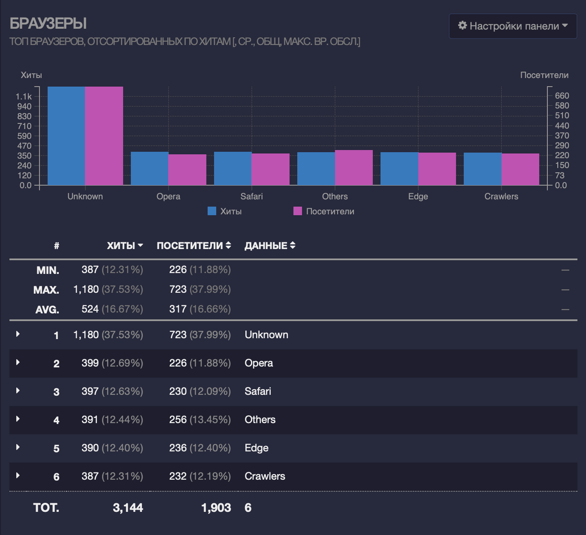

# GoAccess

## Общий трафик: 

GoAccess может отображать общую статистику по количеству запросов, уникальных посетителей, просмотров страниц и другим общим метрикам, которые помогают оценить общую активность на вашем веб-сайте.  

## Уникальные посетители: 

Это количество уникальных IP-адресов (или идентификаторов клиента) в журнале доступа за указанный период времени. Он показывает количество уникальных посетителей, которые посетили ваш веб-сайт.

## Запросы: 

Это общее количество запросов, отправленных на ваш веб-сервер за указанный период времени. Запросы могут быть любыми HTTP-запросами, отправленными клиентами, такими как получение страницы, загрузка файлов, выполнение API-запросов и т. д.

## Ненайденные URL 

относятся к URL-адресам, которые были запрошены клиентами, но не были найдены на веб-сервере.

## Информация о браузерах и ОС: 
GoAccess может предоставить информацию о браузерах, операционных системах и устройствах, которые используют ваши посетители. Вы можете увидеть самые популярные браузеры, версии операционных систем и другие подробности, которые могут быть полезны для анализа целевой аудитории.  

## Распределение по времени

 отображает, как количество запросов распределено по различным временным интервалам. Это помогает визуализировать активность посетителей на вашем веб-сервере в течение определенного периода времени.

## Коды ответов HTTP

отображает информацию о кодах ответов, которые ваш веб-сервер возвращает клиентам в ответ на их запросы. Коды ответов HTTP указывают на результат обработки запроса и позволяют клиенту и серверу взаимодействовать по протоколу HTTP.

