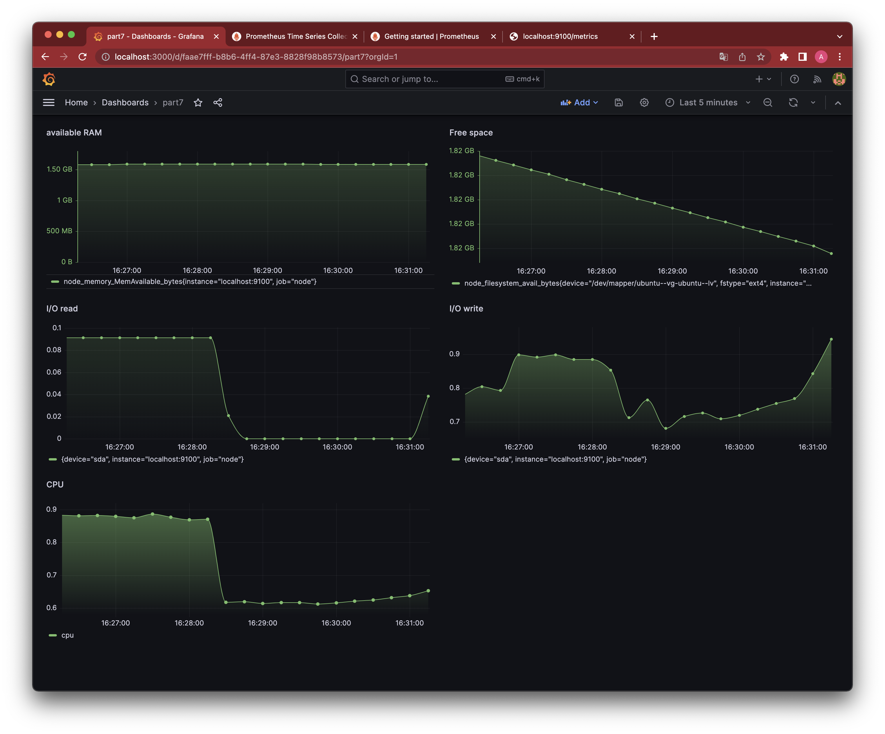
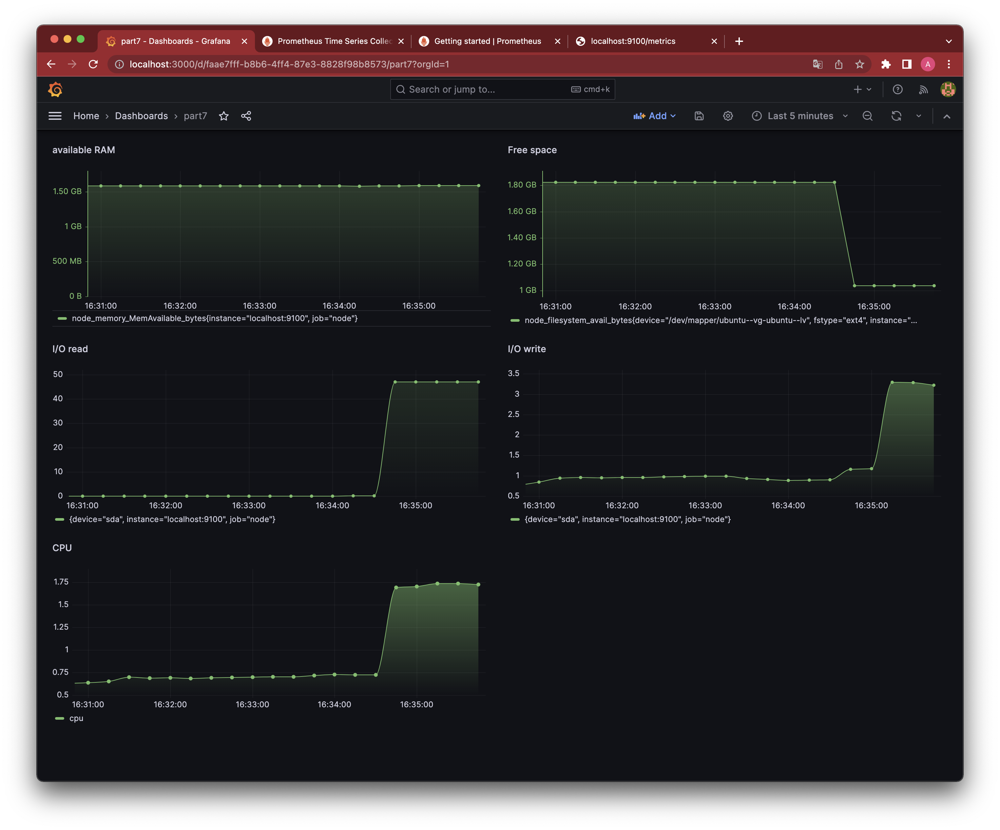
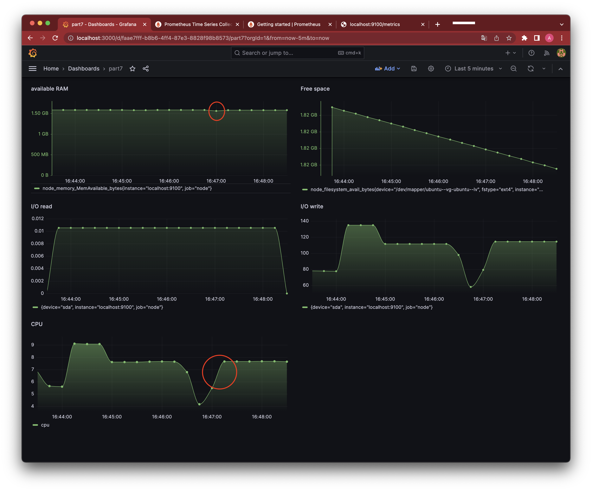

# Part 7. Prometheus и Grafana

- **Добавили на дашборд Grafana отображение ЦПУ, доступной оперативной памяти, свободное место и кол-во операций ввода/вывода на жестком диске**  

- **Нагрузка жесткого диска (место на диске и операции чтения/записи) после запуска bash-скрипта из Части 2**  

- **Нагрузка жесткого диска, оперативной памяти и ЦПУ после использования команды `stress`** 

