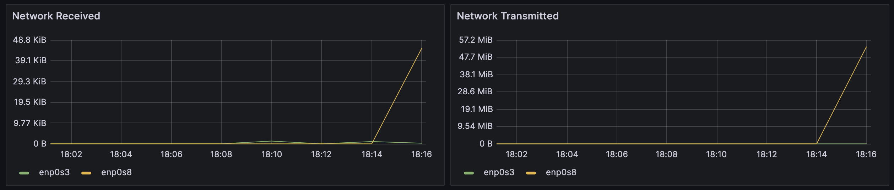

# Part 8. Готовый дашборд

- **Провели тесты из части 7**
    - **После запуска bash-скриптов из части 2**

    

    - **Тест командой `stress`**  

    

- **Нагрузка сетевого интерфейса после теста iperf3** 

