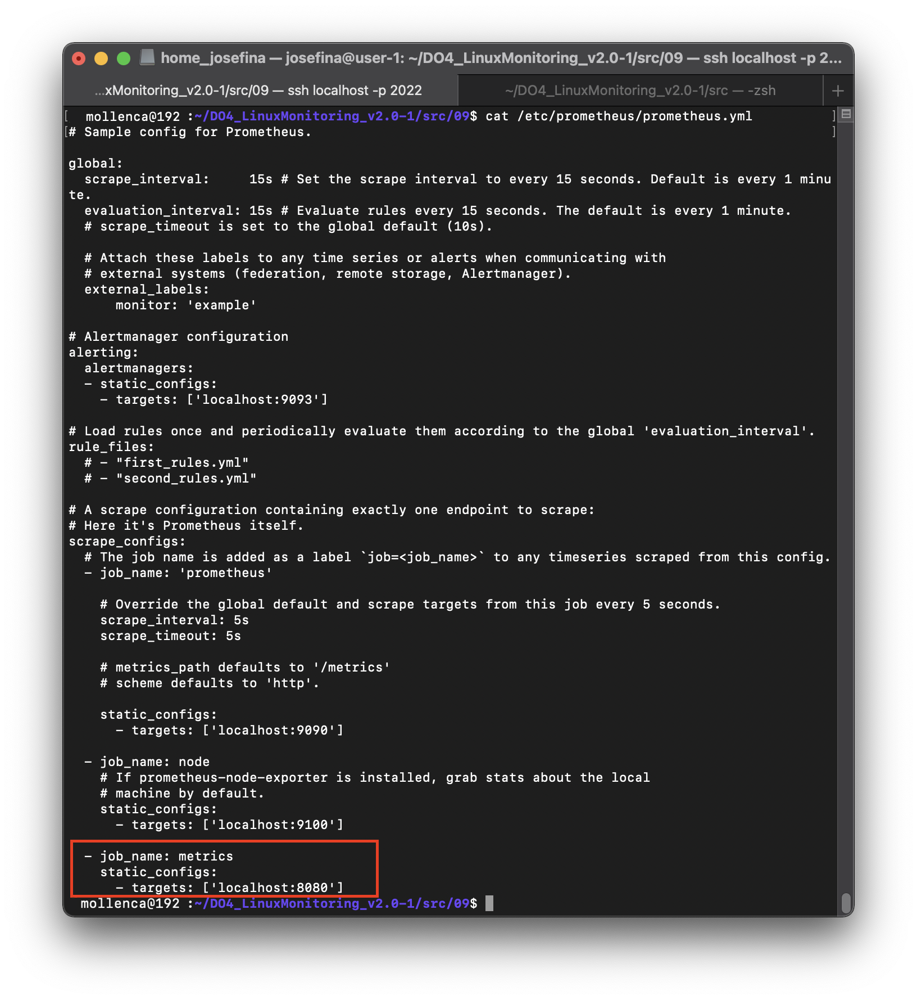
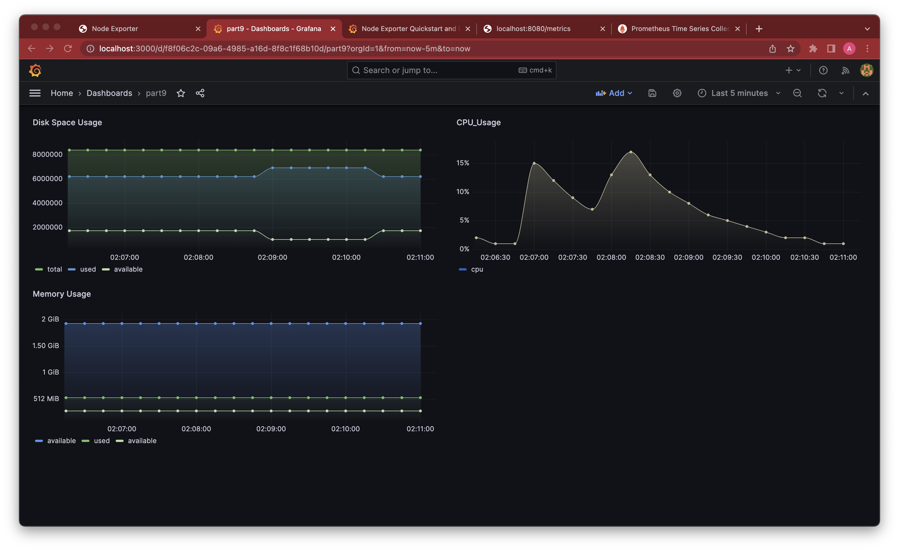
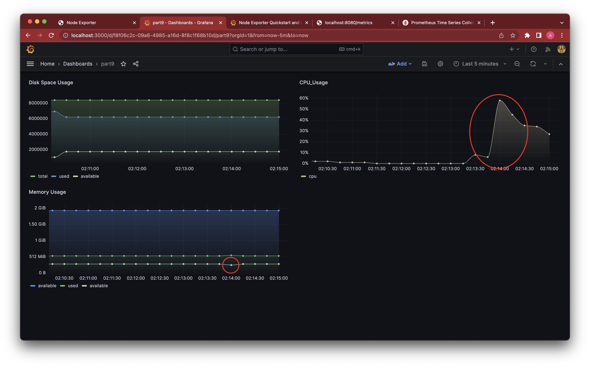

# Part 9. Свой node_exporter

- **Поменяли конфигурационный файл Prometheus, чтобы он собирал информацию с созданной странички.**

    

- **Провели тесты из части 7**
    - **После запуска bash-скриптов из части 2**

    

    - **Тест командой `stress`**  

    

